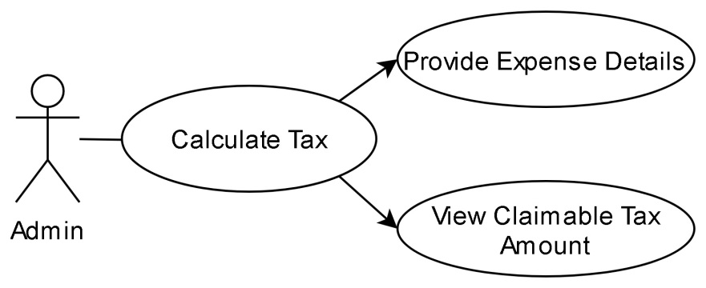
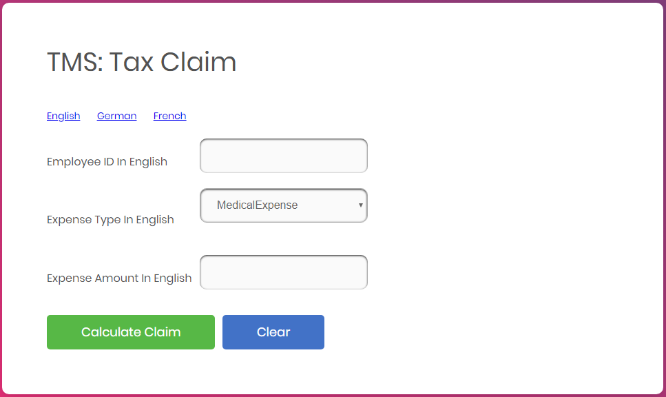
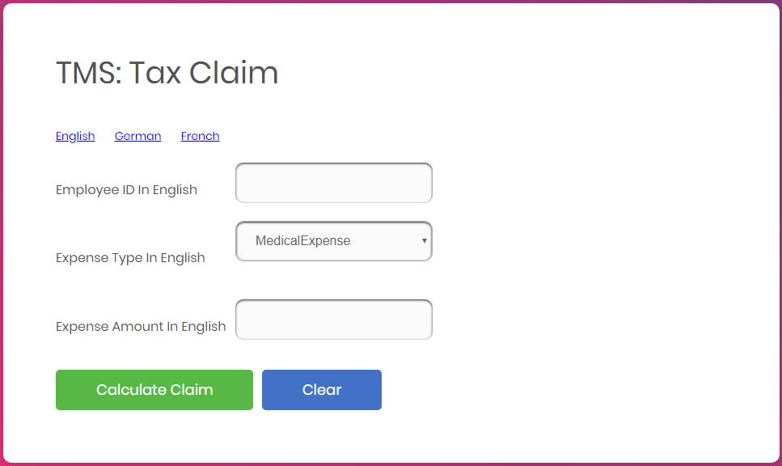
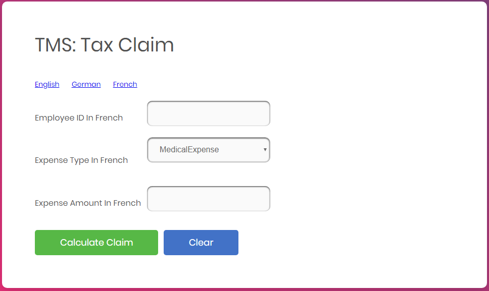
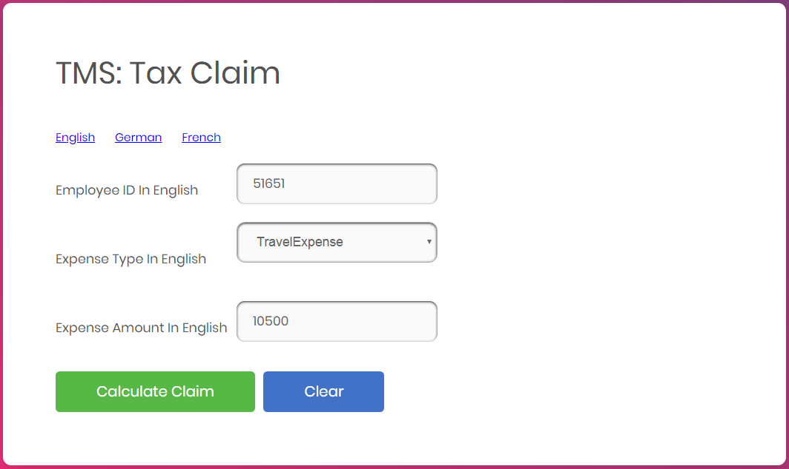
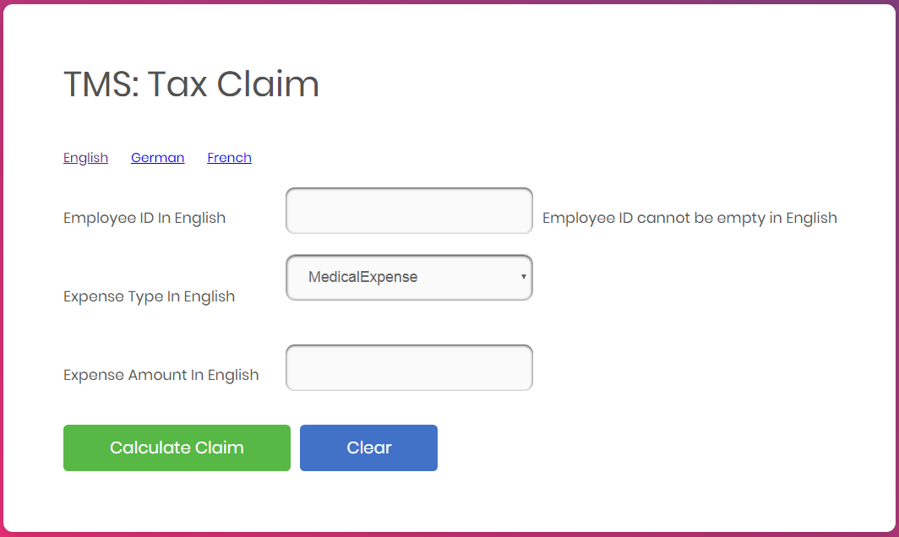
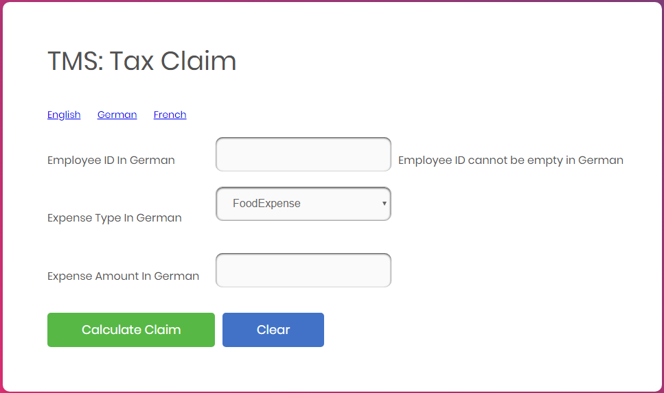
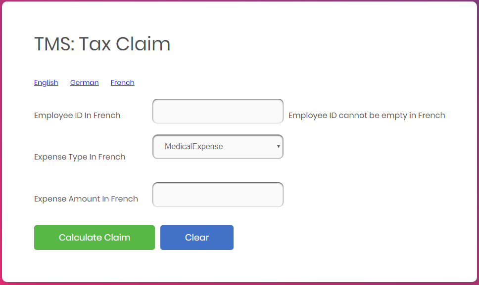
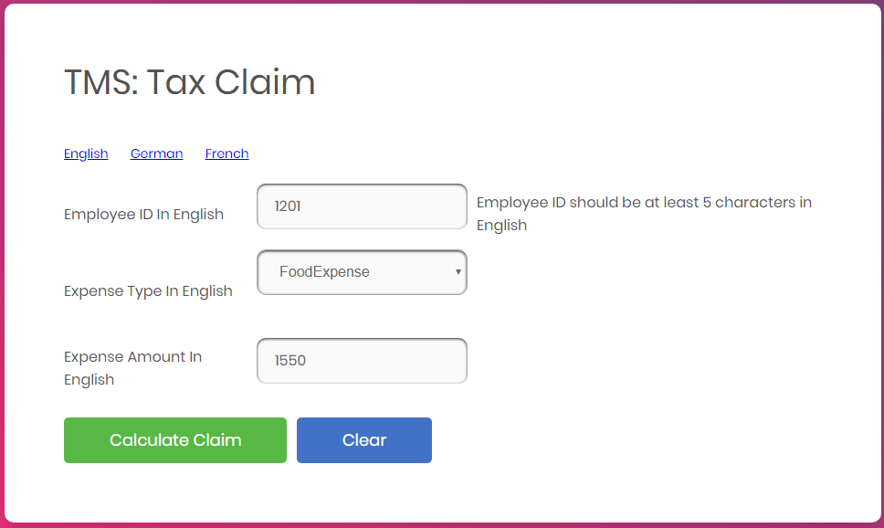
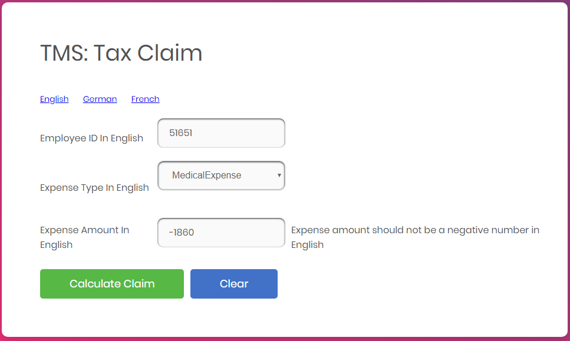

# Tax Management System

## Introduction

### Functional Requirement

The Tax Management System is an application used by the client who is having a group of companies which provide various services like transport, food, accommodation, hospitals, institutes, and so on. The client had offered a benefit to their employees as, if an employee uses the services provided by their own group of companies, a claim of the tax amount will be provided as reimbursement to the employee.  The accounts administrator needs to manually calculate the tax claim amount from each employee based on the expense type and expense amount. 

To automate this calculation process, develop a Spring boot, Spring MVC application. This application needs to get employee id, expense amount and expense type as input. Based on the business rules given below, the claim amount should be calculated and displayed. The application will be used by the account’s admin of the company. 

### User Case Diagram

## Technical Specification

### Process Flow

The first page of the application is taxclaim.jsp page, this page should have the below form components.

| Component | Component Type | Component ID |
| --------- | -------------- | ------------ |
| Employee ID | Textbox | employeeId |
| Expense Type | Drop down | expenseType |
| Expense Amount | Textbox | expenseAmount |
| Calculate Claim | Submit | calculateClaim (should be name and not id) |

In the same page we have the provision to choose language English, German and French. By default, the page content will be displayed in English. If we choose the language as French the label content and the error message in the page should displayed in French and if we choose the language as German the label content and the error message in the page should displayed in German. Ensure you implement the concept of Internationalization.

In the taxclaim.jsp page, ensure you use the component type and id correctly as specified in the above table. 

Assumption: The expense amount entered will be in rupees always.

The values in the Expense Type drop-down must be auto populated from the controller with the values as given in the below table. They should not be populated/hardcoded inside the JSP.

| Expense Type | 
| ------------ |
| MedicalExpense |
| TravelExpense |
| FoodExpense |

Sample taxclaim.jsp for displaying the page content in English

Sample taxclaim.jsp for displaying the page content in German

Sample taxclaim.jsp for displaying the page content in French

The Calculate Claim button, on-click after all successful validations, must generate the tax claim amount based on the expense type and expense amount in the result.jsp file. In this page the message should be displayed as “The tax claim for `expenseType` with expense amount `expenseAmount` is `taxClaimAmount`”.  The result should be rendered inside the `h2` tag.  

### Business Validation

*Rule*: Employee ID field is mandatory. 

*Message*: Employee ID cannot be empty in `<<locale>>`

- If validation fails, UI should display the error message - “Employee ID cannot be empty in `<<locale>>`”.  

*Rule*: Employee ID should be at least 5 characters

*Message*: Employee ID should be at least 5 characters in `<<locale>>`

- If validation fails, UI should display the error message - “Employee ID should be at least 5 characters”.  

*Rule*: Expense Amount should not be a negative number.

*Message*: Expense amount should not be a negative number in `<<locale>>`

- If the validation fails, UI should display the error message - “Expense amount should not be a negative number in `<<locale>>`”

**Note**: The messages have to be retrieved from the appropriate properties file. The Property file has been given as part of code skeleton.

The table along with the tr and td tags are provided as part of the code skeleton. Each td is provided with the id attribute. Do not change the id value which is provided as part of the code skeleton. Include the required Spring UI tag for Internationalization in the first column, the corresponding component in the second column and the Spring tag for Internationalization to display the error message in the third column for all the rows as shown below.

### Control Flow

By giving the request /getTaxClaimFormPage from the browser (Eg: http://localhost/8080/getTaxClaimFormPage), the admin should be redirected to the Tax Claim page which is taxclaim.jsp 

Admin will enter the employee id, choose the expense type and enter expense amount. 

On clicking calculate claim button, the expense amount should be validated as per the business rules & validations.

The tax claim amount should be calculated and displayed in the page is result.jsp

### Business Rules

Tax paid for each expense type is given in the table below.

<table>
<thead>
<tr>
<td rowspan="2">Expense Type</td>
<td colspan="3">Tax percentage based on Expense Amount Range</td>
</tr>
<tr>
<td>Up to 1000</td>
<td>1001 to 10000</td>
<td>Above 10000</td>
</tr>
</thead>
<tbody>
<tr>
<td>MedicalExpense</td>
<td>15</td>
<td>20</td>
<td>25</td>
</tr><tr>
<td>TravelExpense</td>
<td>10</td>
<td>15</td>
<td>20</td>
</tr><tr>
<td>FoodExpense</td>
<td>5</td>
<td>10</td>
<td>15</td>
</tr>
</tbody>
</table>

Tax claim amount = Expense amount * (Tax percentage /100)

Calculate the tax claim amount and display the same in result.jsp.

## Compoenent Specification

#### Controller

**TaxController**

| Attribute Name | Attribute Type | Access Specifier | Constraints |
| -------------- | -------------- | ---------------- | ----------- |
| taxService | TaxServiceInterface | private | Use annotation to autowire |

| Method Name | Method Argument name:type | Return type | RequestMapping URL & Request Method |
| ----------- | ------------------------- | ----------- | ----------------------------------- |
| claimPage | modelAttribute “userClaim”:UserClaim | String | /getTaxClaimFormPage & GET |
| calculateTax | modelAttribute “userClaim”:UserClaim,  result:BindingResult, map:ModelMap | String	 | /calculateTax  & GET | 
| populateExpense |  |`List<String>` | Should be annotated with ModelAttribute with name “expenseList” |

Inside the populateExpense method you should add all the 3-expense type into the list and return the list.

TaxService interface should be autowired inside the Controller via annotations

TaxServiceImpl must calculate the tax claim amount based on the Expense Entity that has the expenseType and the expenseAmount of the admin. 

#### Service

TaxService interface should be configured via annotation as Service

| Method Name | Method Argument name:type | Return type	Responsibilities |
| ----------- | ------------------------- | ---------------------------- |
| calculateTax | “userClaim”:UserClaim | double | This method should calculate the claim amount based on the expense type and expense amount. |

TaxServiceImpl must implement TaxService interface.

#### Model

| Class(Model) | Property |	Methods |
| ------------ | -------- | ------- |
| UserClaim | expenseType : String expenseAmt : double employeeId : String | 	getters and setters |

Include the needed annotations inside the Expense Entity class for various validations already mentioned. The error messages should be retrieved from the properties file

#### Internationalization

Override the methods in InternationalizationConfig class provided as part of the code skeleton to support Internationalization.

### Request Mapping Tasks

|   |   |
| - | - |
| /getTaxClaimFormPage | Redirect the user to taxclaim.jsp |
| /calculateTax | Should invoke calculateTax method of the Controller after submitting all the valid expense details from taxclaim.jsp, which in turn should invoke the calculateTax method of the TaxServiceImpl and redirect to result.jsp with the appropriate values depicted in the screen design. If there are validation errors it should be redirected to taxclaim.jsp page |

## Overall Design Constraints

1. Implement the code using the best design standards. 
2. Use Internationalization for all the labels and messages in the Tax Claim page. 
3. Tax Claim page should support Internationalization for three languages English, German and French. The error messages and the labels should be displayed from the properties file depending on the locale. The properties file is already provided as part of the code skeleton. 
4. Spring Validator should be used for all the Validations. Use only annotation for performing the validations.
5. TaxManagementApplication which is the main class, is already provided as part of the code skeleton. Include only the required annotations to auto scan the Controller, Service classes.
6. Do not change the property name given in the application.properties files, you can change the value and you can include additional property if needed.
7. In the pom.xml you are provided with all the dependencies needed for developing the application.  
8. You will not be evaluated based on the UI design (layout, color, formatting, etc.). You are free to have a basic UI with all the required UI components (input fields, buttons, labels, etc.). Expected components with the id alone should be designed as per the requirement.

